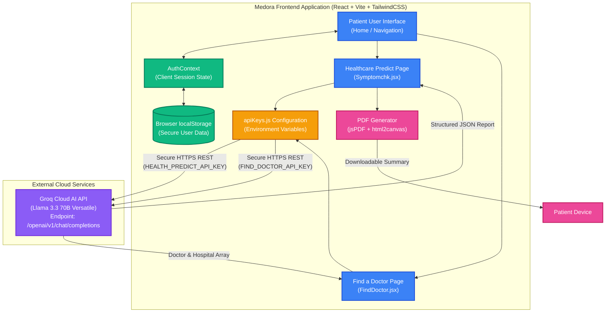

# Medora — AI-Powered Healthcare Platform 🩺

> *Making healthcare intelligent, accessible, and personal — powered by AI.*

[](https://reactjs.org/)
[](https://console.groq.com/)
[](https://vitejs.dev/)
[](https://tailwindcss.com/)

---

## 📌 Problem Statement & Challenges Faced

In today's healthcare landscape, millions of patients face critical challenges when trying to access medical guidance:

- **Lack of Immediate Access**: Patients in Tier 2 and Tier 3 cities face immense barriers — including travel distance, high consultation costs, and long waiting times — just to get basic medical triage.
- **Health Anxiety & Misinformation (Cyberchondria)**: When patients search generic symptoms on traditional search engines, they are bombarded with conflicting, worst-case scenarios that trigger severe anxiety.
- **Complex, Gatekept Platforms**: Existing digital health platforms are either overwhelmingly complex (requiring prior lab reports, prescriptions, and mandatory doctor approvals) or purely transactional (basic appointment directories with zero medical intelligence).
- **Delayed Medical Intervention**: Without a clear understanding of symptom severity, patients frequently delay seeking urgent care until a condition becomes critical.

### ⚠️ Technical & Architectural Challenges We Faced
While designing a solution to these problems, our engineering team encountered significant hurdles with traditional web architectures:
1. **Backend & Database Bottlenecks**: Maintaining a dedicated backend server and database (like MongoDB/Express) introduced unnecessary latency, high hosting costs, and complex server maintenance overhead for what should be an instantaneous patient tool.
2. **AI Response Latency**: Traditional LLM APIs (OpenAI, Gemini) often suffered from high latency (10-15 seconds) when generating large, structured medical reports, leading to poor user experience.
3. **Data Privacy & Compliance Concerns**: Storing sensitive patient symptom logs and medical queries on a centralized database created massive privacy and compliance liabilities.
4. **API Quota & Regional Restrictions**: Free-tier AI endpoints frequently rate-limited our requests or blocked access based on geographical regions.

---

## 💡 What We Made (The Medora Solution)

To overcome both the clinical and technical challenges, we engineered **Medora** — a blisteringly fast, **frontend-only AI healthcare companion** built on React, Vite, and Tailwind CSS. 

Medora completely eliminates backend complexity while delivering state-of-the-art medical AI intelligence directly to the patient's device:

1. **Plain-English Symptom Triage**: Patients describe their symptoms naturally, without needing medical jargon or prior health records.
2. **Ultra-Fast Groq AI Engine**: Powered by **Groq's Llama 3.3 70B** model running on LPUs (Language Processing Units), Medora generates comprehensive, 10-section structured health reports in under 2 seconds.
3. **Instant Professional PDF Export**: Using client-side `jsPDF` and `html2canvas`, patients can instantly download clean, formatted medical reports to share directly with their physical doctors.
4. **Intelligent Doctor Discovery**: A smart, city-based search engine that instantly connects patients with the top 10 specialized doctors and multi-specialty hospitals near them.
5. **Zero-Liability Client Auth**: All patient onboarding and session data are securely managed via browser `localStorage`. No patient health queries or personal data are ever stored on an external database, guaranteeing absolute privacy.

---

## ⚖️ How Medora Differs from Current Healthcare Systems

Most existing healthcare applications treat the patient as a mere consumer for booking appointments or buying medicines. Medora treats the patient as an empowered individual seeking immediate, intelligent medical clarity.

| Feature / Dimension | 🏥 Traditional Apps (Practo, 1mg, Apollo) | 🏥 Hospital Portals | 🌟 Medora (Our System) |
|---|---|---|---|
| **Primary Focus** | Commercial appointment booking & pharmacy sales | Managing existing patient records & billing | **Instant AI symptom triage & patient medical clarity** |
| **Barrier to Entry** | High (Mandatory phone OTPs, complex profile setups) | High (Requires existing Patient ID / MRN) | **Zero (Instant access, simple local session auth)** |
| **Medical Intelligence** | None (Static search filters and generic blogs) | None (Static doctor schedules) | **Advanced AI (Llama 3.3 70B clinical analysis)** |
| **Output Provided** | Booking confirmation slips & invoices | Lab test results & visit summaries | **Comprehensive 10-section diagnostic PDF report** |
| **Backend Complexity** | Massive monolithic servers & cloud databases | Heavy legacy hospital databases | **100% Client-side (Zero server maintenance overhead)** |
| **Patient Privacy** | Queries & searches are tracked and monetized | Stored permanently on hospital servers | **Absolute Privacy (Zero database logging)** |

---

## 🤖 How Medora Differs from Generic AI (ChatGPT, Gemini, Claude)

While generic LLMs are powerful, they are not designed or optimized for clinical healthcare workflows. Medora acts as a specialized medical guardrail that transforms raw LLM capabilities into a safe, clinical-grade patient tool.

```
┌────────────────────────────────┐         ┌────────────────────────────────┐
│       GENERIC AI CHATBOTS       │         │        MEDORA AI ENGINE        │
│   (ChatGPT, Gemini, Claude)    │         │     (Clinical Guardrails)      │
├────────────────────────────────┤         ├────────────────────────────────┤
│ • Unstructured conversational  │         │ • Strict 10-section clinical   │
│   text blocks                  │         │   JSON schema enforced         │
│ • Prone to rambling and        │         │ • Embedded medical disclaimers │
│   generic medical disclaimers  │         │   & red-flag emergency alerts  │
│ • Requires complex patient     │         │ • Zero prompt engineering      │
│   prompt engineering           │         │   required by the patient      │
│ • Cannot discover local city   │         │ • Built-in city-based doctor & │
│   doctors or hospitals         │         │   hospital discovery           │
│ • No professional medical PDF  │         │ • Instant, formatted clinical  │
│   export capabilities          │         │   PDF report generation        │
└────────────────────────────────┘         └────────────────────────────────┘
```

### Key Differentiators:
1. **Enforced Clinical Structure**: Instead of a rambling chat stream, Medora forces the AI to output a strict, validated JSON schema containing exactly 10 essential clinical sections (Possible Conditions, Risk Analysis, Immediate Steps, Dietary Advice, etc.).
2. **Zero Prompt Engineering**: Patients don't need to know how to "prompt" an AI. They simply type their symptoms, and Medora's background configuration injects sophisticated medical guardrails and role definitions automatically.
3. **Actionable Local Discovery**: ChatGPT cannot reliably book or find specific local hospital contact details. Medora features a dedicated "Find a Doctor" module that identifies top local specialists based on the patient's exact city.
4. **Professional Presentation**: Chatbots leave you with text you have to copy-paste. Medora generates a beautifully styled, downloadable PDF report that looks like a formal clinical summary, ready to be handed to a physician.

---

## 🚀 Key Features

| Feature | Description |
|---|---|
| 🩺 **Healthcare Predict** | Type symptoms in plain English and get a full AI-generated health report |
| 📄 **PDF Health Reports** | Download detailed reports covering conditions, risks, medications, diet, and lifestyle |
| 🏥 **Find a Doctor** | Search any Indian city and get top 10 doctors/hospitals with ratings, timings and contact |
| 🔐 **Patient Auth** | Simple sign up & login with session stored in `localStorage` — no database needed |
| 📜 **Marquee Testimonials** | Auto-scrolling patient reviews from real use-case scenarios |
| 📱 **Fully Responsive** | Works seamlessly across desktop, tablet, and mobile |

---

## 🏗️ System Architecture

Medora's architecture is engineered for maximum speed, security, and simplicity. By decoupling the frontend from traditional backend servers and communicating directly with Groq's ultra-fast LPU cloud, we achieve unmatched performance.



```
┌──────────────────────────────────────────────────────────────┐
│                        MEDORA FRONTEND                        │
│                      (React + Vite + TailwindCSS)            │
│                                                              │
│  ┌────────────┐    ┌─────────────────┐    ┌──────────────┐  │
│  │  Auth      │    │ Healthcare       │    │  Find a      │  │
│  │  Context   │    │ Predict Page    │    │  Doctor Page │  │
│  │ (localStorage) │    │ (Symptomchk.jsx)│    │(FindDoctor.jsx)│  │
│  └────────────┘    └────────┬────────┘    └──────┬───────┘  │
│                             │                     │          │
│                    ┌────────▼─────────────────────▼───────┐  │
│                    │           apiKeys.js (ENV Config)    │  │
│                    │  HEALTH_PREDICT_API_KEY               │  │
│                    │  FIND_DOCTOR_API_KEY                  │  │
│                    └────────────────────┬────────────────┘  │
│                                         │                    │
└─────────────────────────────────────────┼────────────────────┘
                                          │ HTTPS REST API
                                          │
                          ┌───────────────▼──────────────────┐
                          │          GROQ CLOUD API           │
                          │   Model: llama-3.3-70b-versatile  │
                          │   Endpoint: /openai/v1/chat/      │
                          │            completions            │
                          └──────────────────────────────────┘
```

---

## 🗺️ System Diagram

```
Patient Opens Medora
        │
        ▼
┌───────────────┐
│  Home Page    │──── Marquee Testimonials, Feature Cards, FAQ
└───────┬───────┘
        │
   ┌────┴────┐
   │  Login  │ ──► LocalStorage Session (name, email, role)
   │ /Signup │
   └────┬────┘
        │
   ┌────▼──────────────────────────────────┐
   │              NAVIGATION               │
   │  Healthcare Predict | Find Dr | Contact│
   └──────┬─────────────────┬──────────────┘
          │                 │
   ┌──────▼──────┐   ┌──────▼──────────┐
   │  Symptom    │   │  Find a Doctor  │
   │  Input Box  │   │  City Search    │
   └──────┬──────┘   └──────┬──────────┘
          │                 │
   ┌──────▼──────┐   ┌──────▼──────────┐
   │ Groq API    │   │ Groq API        │
   │ (Health Key)│   │ (Doctor Key)    │
   └──────┬──────┘   └──────┬──────────┘
          │                 │
   ┌──────▼──────┐   ┌──────▼──────────┐
   │ AI Report   │   │ Doctor Cards    │
   │ (JSON)      │   │ (JSON Array)    │
   └──────┬──────┘   └─────────────────┘
          │
   ┌──────▼──────┐
   │ PDF Download│
   │ (jsPDF +    │
   │  html2canvas)│
   └─────────────┘
```

---

## 🔄 Application Workflow

### 1. Patient Onboarding
```
Visit Medora → Sign Up (name, email, password, gender)
→ LocalStorage saves session → Login → Header shows username
```

### 2. Healthcare Predict Flow
```
Patient types symptoms in plain English
    │
    ▼
Groq API (llama-3.3-70b-versatile) processes prompt
    │
    ▼
AI generates structured JSON report:
  • Possible Conditions
  • Symptom Analysis
  • Risks If Ignored
  • Immediate Steps
  • Precautions
  • Medications & Remedies
  • Dietary Advice
  • Lifestyle Recommendations
  • When to See a Doctor
  • Medical Disclaimer
    │
    ▼
Report rendered on screen in color-coded sections
    │
    ▼
Patient clicks "Download PDF" → jsPDF + html2canvas generates PDF
```

### 3. Find a Doctor Flow
```
Patient enters city name (e.g. "Pune")
    │
    ▼
Groq API generates realistic list of top 10:
  • Multi-specialty hospitals
  • Specialist doctors (Cardio, Ortho, Neuro, etc.)
    │
    ▼
Each card shows:
  • Name, Type, Specialization
  • Address, Phone, Timings
  • Star Rating
  • Available services (Consultation, Emergency, Lab Tests)
    │
    ▼
"Book Appointment" button on each card
```

---

## 🛠️ Technology Stack

| Layer | Technology | Purpose |
|---|---|---|
| **Frontend Framework** | React 18 + Vite | UI rendering and build tooling |
| **Styling** | Tailwind CSS 3 | Utility-first responsive design |
| **Routing** | React Router v6 | Client-side page navigation |
| **State Management** | React Context API | Global auth state |
| **Session Storage** | `localStorage` | Persist user login without a database |
| **AI Engine** | Groq API (Llama 3.3 70B) | Health analysis and doctor search |
| **PDF Generation** | jsPDF + html2canvas | Convert report to downloadable PDF |
| **UI Components** | React Icons, React Spinners, React Toastify | Icons, loaders, and toast notifications |
| **Scroll Animations** | CSS `@keyframes` marquee | Testimonial auto-scroll |

---

## 📁 Project Structure

```
medora/
├── frontend/
│   ├── public/
│   ├── src/
│   │   ├── assets/
│   │   │   ├── data/         # FAQs, services data
│   │   │   └── images/       # Static assets
│   │   ├── components/
│   │   │   ├── About/
│   │   │   ├── Faq/
│   │   │   ├── Footer/
│   │   │   ├── Header/
│   │   │   └── Testimonial/  # Marquee reviews
│   │   ├── configs/
│   │   │   └── apiKeys.js    # Groq API config (via .env)
│   │   ├── context/
│   │   │   └── AuthContext.jsx  # Global auth state
│   │   ├── pages/
│   │   │   ├── Home.jsx
│   │   │   ├── Login.jsx
│   │   │   ├── Signup.jsx
│   │   │   ├── Contact.jsx
│   │   │   ├── Symptomchk.jsx   # Healthcare Predict
│   │   │   └── Doctors/
│   │   │       ├── FindDoctor.jsx  # AI Doctor Search
│   │   │       └── Doctors.jsx
│   │   ├── routes/
│   │   │   └── Routers.jsx
│   │   ├── App.jsx
│   │   ├── main.jsx
│   │   └── index.css
│   ├── .env                  # API Keys (not pushed to git)
│   ├── index.html
│   ├── package.json
│   ├── tailwind.config.js
│   └── vite.config.js
├── .gitignore
├── readme.md
└── run commands.txt
```

---

## ⚙️ Installation & Setup (Step-by-Step Guide)

We have designed Medora to be incredibly simple to clone and run. You do not need any complex backend setup or databases!

### Prerequisites
- **Node.js**: v16 or higher installed on your machine.
- **Groq API Key**: Get a free API key instantly at [console.groq.com/keys](https://console.groq.com/keys).

### Step-by-Step Cloning & Running

```bash
# 1. Clone the repository
git clone https://github.com/Apurvk28/medora.git

# 2. Navigate into the frontend directory
cd medora/frontend

# 3. Install all required dependencies
npm install

# 4. Set up your Environment Variables
# Copy the provided example environment file to create your own .env file
cp .env.example .env

# 5. Open the newly created .env file in your editor and paste your Groq API key:
# VITE_HEALTH_PREDICT_API_KEY=gsk_your_actual_key_here
# VITE_FIND_DOCTOR_API_KEY=gsk_your_actual_key_here

# 6. Start the development server
npm run dev
```

Once running, open your browser and navigate to **[http://localhost:5173](http://localhost:5173)** (or `http://localhost:5174` if port 5173 is busy).

---

## 🔐 Environment Variables Explained

Medora uses Vite environment variables. We have provided a ready-to-use `.env.example` file in the `frontend/` directory.

When you copy `.env.example` to `.env`, you will see the following structure:

```env
# 1. GROQ AI API KEYS (REQUIRED)
VITE_HEALTH_PREDICT_API_KEY=gsk_your_groq_api_key_here
VITE_FIND_DOCTOR_API_KEY=gsk_your_groq_api_key_here

# Groq API Endpoint & Model (Defaults are already configured in code, but can be overridden here)
VITE_GROQ_API_URL=https://api.groq.com/openai/v1/chat/completions
VITE_GROQ_MODEL=llama-3.3-70b-versatile

# 2. CLOUDINARY CONFIGURATION (OPTIONAL)
# Required only if you want to enable profile image uploads. Otherwise, a local fallback works automatically!
VITE_CLOUD_NAME=your_cloudinary_cloud_name
VITE_UPLOAD_PRESET=your_cloudinary_upload_preset
```

### 💡 Why Medora is Foolproof:
- **Zero-Config Defaults**: The codebase (`src/configs/apiKeys.js`) automatically falls back to the correct Groq API endpoints and Llama 3.3 model if you don't specify them in `.env`. You literally only need to supply your API keys!
- **Optional Cloudinary**: If you don't configure Cloudinary keys, `uploadCloudinary.js` gracefully falls back to generating local mock URLs so you can still test uploading profile pictures without errors.
- **Secure**: Your `.env` file is safely ignored in `.gitignore`, preventing accidental commits of your private keys.

---

## 🎯 Use Cases

1. **A college student** experiencing fatigue and headaches types their symptoms → Gets a detailed PDF report → Shows it to the campus doctor.
2. **A working professional** in a new city needs a cardiologist → Searches "Mumbai" in Find a Doctor → Gets top-rated specialists instantly.
3. **A parent** worried about their child's recurring fever → Uses Healthcare Predict → Gets dietary advice and clear guidance on when to visit the ER.
4. **A senior citizen** wants to understand their symptoms without complex medical jargon → Gets plain-English explanations with actionable steps.

---

## 🧪 API Details

### Healthcare Predict
- **Endpoint**: `POST https://api.groq.com/openai/v1/chat/completions`
- **Model**: `llama-3.3-70b-versatile`
- **Input**: Plain English symptom description
- **Output**: Structured JSON with 10 health report sections

### Find a Doctor
- **Endpoint**: `POST https://api.groq.com/openai/v1/chat/completions`
- **Model**: `llama-3.3-70b-versatile`
- **Input**: City name
- **Output**: Array of 10 doctor/hospital objects with full details

---

## 📄 License

This project is licensed under the MIT License.

---

## 👨‍💻 Author

**Apurv Khairnar**  
GitHub: [@Apurvk28](https://github.com/Apurvk28)

**Kaustubh Patil**  
GitHub: [@patilkaustubh439-ops](https://github.com/patilkaustubh439-ops)

---

*Medora — Empowering patients with AI-driven healthcare intelligence.* 🩺